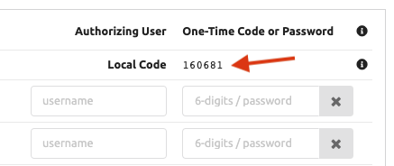

title: Local Codes
order: 10
hidden: 1

[_(new in v3.1.0, requires Mk3)_](upgrade)

## Local Confirmation Codes

{.snap}

The only interaction possible with a Coldcard in HSM mode is to
enter a local authorization code. This can be required by specific
HSM policy rules, and perhaps not all transactions would require
local authorization.

As you press the 6-digit numeric code, the digits are shown in the
top right part of the screen. Press OK to apply them, or X to clear
and start over. Codes are always 6 digits. There is no indication
the code worked or failed, in part because it isn't tested until
the PSBT is given for signing, which could be some time later.

{.snap}

The required 6-digit code is a combination of the specific bytes
of the PSBT file being approved, and also a salt value picked by
the Coldcard.  If you have the PSBT file to be approved, you can
use the `ckcc local-conf` command to show the code needed:

```sh
% ckcc local-conf debug/attempt.psbt
Local authorization code is:
	160681

```

However, most will use the CKBunker, which reveals the local code as shown here:



A different code will be required for each attempted signing (because
Coldcard changes the salt value) and for every PSBT file (because
the hash of the PSBT is a factor in this number).

